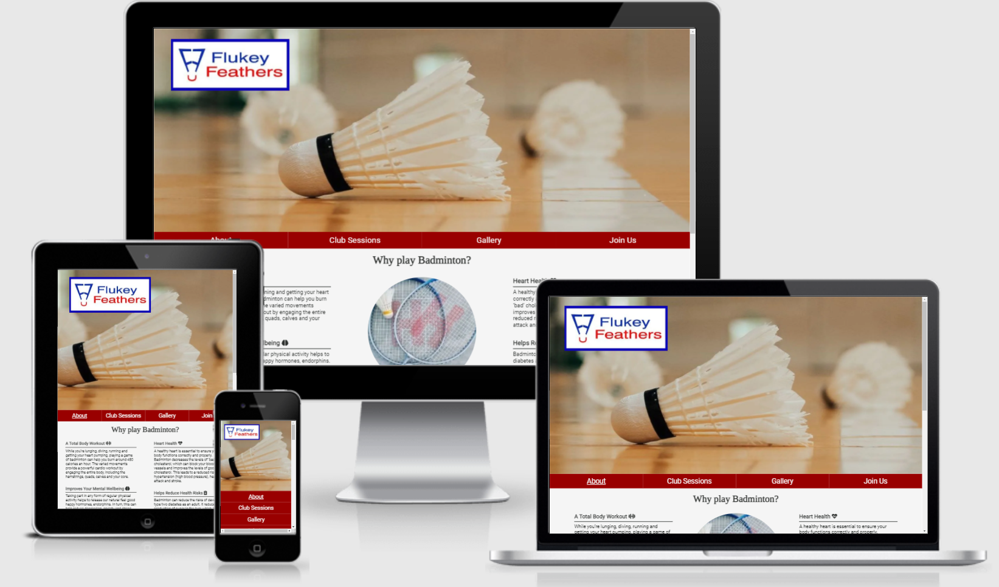
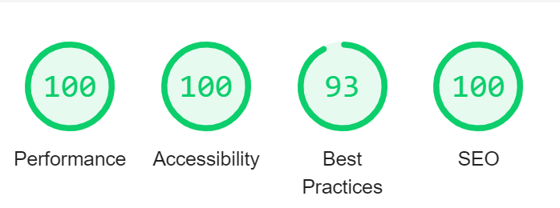
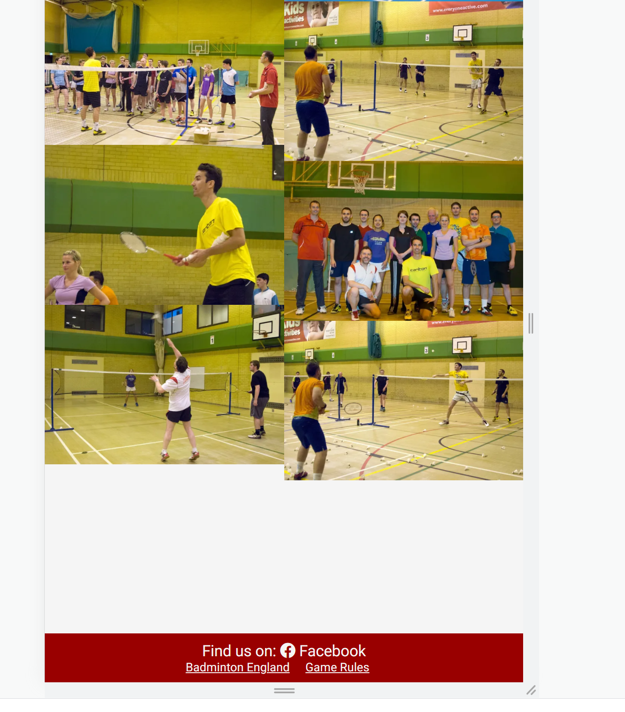

# **Flukey Feathers Badminton Club**

Flukey Feathers is a site that is designed to help people choose Badminton as a sport to play and Flukey Feathers as the club to join no matter what their skill set is.
The site is targeted towards potential or current badminton players based in or around the Bournemouth area who are looking for somewhere to play that is both friendly and social. 

## Table of contents
1. [**Planning Stage**](#planning-stage)
1. [**Features Common to all Pages**](#features-common-to-all-pages)
1. [**Features on Individual Pages**](#features-on-individual-pages)
1. [**Future Features to be Added**](#future-features-to-be-added)
1. [**Testing**](#testing)
1. [**Bugs**](#bugs)
1. [**Other Changes**](#other-changes)

## **Planning Stage**

### **Target Audience**
* Users who are looking to take up badminton as a sport to play
* Users who are looking to join a badminton club
* Users who are looking to switch badminton clubs

### **Site Aims**
* Educate the user on the health benefits of playing badminton
* Show the user the benefits of playing badminton with Flukey Feathers
* Provide the user with information that tells them when and where Flukey Feathers plays
* Give the user an opportunity to contact the club to join them

### **Wireframes**
To help organise how I was going to approach building the site I first got my initial ideas down onto some wireframe to help guide me through the basic layout of the site as I implemented various features. 
Links to the different pages:
* [Homepage (About)](docs/wireframes/home-about.png)
* [Club Sessions page](docs/wireframes/club-sessions.png)
* [Join Us page](docs/wireframes/join-us.png)

There was some deviation from the initial design as I implemented each page to improve the user experience but in general I stayed true to the initial design.

### **Color Scheme**
I chose a color scheme that was in keeping with the Flukey Feathers color scheme (red) whilst also being  easy to read for the user, through the use of back ground images and the navigation / footer color schemes, opting for a smokey white background and dark grey text in areas where these weren't used. 

## **Features Common to all Pages**
### **Hero Image**

* Designed to catch the eye when loading the page
* In theme with the FLukey Feathers club it features a shuttle cock on a badminton court
* A smaller version of the hero image is used for mobile layouts so it take up less screen real estate and doesn't dominate the page

### **Club Logo**

* Located within the hero image the logo so the user knows the site is about Flukey Feathers
* It also serves as a link back to the home page
* The logo scales on mobile screens as the screen size gets smaller so it doesn't dominate the hero image

### **Navigation Bar**

 * Located directly below the hero image
 * Its red background is designed to be eye catching and in line with Flukey Feathers' club color scheme
 * For ease of navigation as the mouse is hovered over a link, the background turns black so the user can see what they are selecting
 * The current page a user is on as a link that is underlined
 * As the page size decreases the nav bar is fully responsive and at the mobile level displays as a block vertically rather than horizontally
 * The navigation bar is designed as a journey for the user going from left to right as they explore the reasons why they should join Flukey Feathers before finally deciding to join the club

 ### **Footer**

 * Located at the bottom of the page
 * Its red background is designed to be eye catching and in line with Flukey Feathers' club color scheme
 * The footer has links to FLukey Feathers facebook page
 * There are also links to the Badminton England site and game rules site for users to explore their interest further
 * As the page size decreases the Badminton England and game rules links center on the page so they fit better in a tall narrow layout
 * Links to Badminton England and game rules are underlined to show they are 2 seperate links as they looked like 4 links (1 per word) before this was applied
 * The facebook link had its underlining removed as it was obvious this was a link

 ## **Features on Individual Pages**
 ### **About Us (Home) Page**
 
 * The About Us section will allow the user to see the benefits of playing badminton, encouraging the user to consider badminton as a form of exercise
 * It also shows the user the benefits of joining Flukey Feathers as their choice of club to play badminton and continue to explore the site
 * As the page size decreases the text area takes up more of the page with the images being pushed below. Finally as the page size reaches mobiles the benefits become block and display as a list, making usability on smaller screens easier

 ### **Club Sessions Page**

 * The club sessions page shows the user when Flukey Feathers plays, where they play, how much it costs and what skill level it caters for
 * This allows users to choose which session may be best for them with their interests and skill levels
 * A background image is used for the club sessions to draw the user in. It is in line of the Flukey Feathers scheme, with a red court surface covered with losts of Shuttlecocks
 * As the page resizes, the club sessions area is fully responsive, eventually displaying in a block list rather than horizontally to aide mobile navigation
 * Beneath the club sessions is an interactive map of the venue Flukey Feathers play at, allowing users to input this into their navigation systems to get directions

### **Gallery Page**

* The gallery will provide supporting images to the user so they can see what various sessions look like
* The gallery is valuable as the user can easily identify whether the club is something they are looking for or not

### **Join Us Page**

* This page will allow the user to join Flukey Feathers
* The user will be asked to submit their personal details as well as their skill level and what sessions they would be interested in joining
* This will allow Flukey Feathers to then discuss with the user which sessions would be appropriate to them
* A background image is used behind the form. This is the same as on the club sessions page for consistency and is inline with the Flukey Feathers club ethos
* The page is fully responsive with the form scaling to fit mobile screens

## **Future Features to be Added**
The Flukey Feathers site is currently at the minimum viable project stage. Future features to be added to increase site usability include:
* A Burger Menu Icon added to the Nav bar on mobile devices that produces a drop down menu when tapped so the Nav bar takes up less space
* A members only area
 * A subs page where members can track what they have paid / what they owe
 * A news page where bulletins can be posted for upcoming league matches / changes to session venues / times
 * An upcoming events page where members can sign up to Badminton England events. E.g. Yonex All English Championships in Birmningham
 * An affiliate links page to various badminton resources / service such as online shops where members can get exclusive discounts through Flukey Feathers

 ## **Testing**
I have tested the site in the Chrome, Firefox and Edge browsers, using dev tools to test responsiveness. I have also asked users to review on mobiles on both Android and IOS and had no issues fed back. 

### **Responsiveness**
 
Whilst the site was designed as Desktop First extensive testing has been done to ensure the site is fully responsive on smaller screens. As well as tesing in dev tools and using various mobile devices I also used (http://ami.responsivedesign.is/) to check for responsiveness. No website breaking issues were found.
As the site changed in size I identified 4 key widths where changes needed to be made.
1. **992px (Laptops)**
  * About US Page
    * Left and right text areas made to take up more page width
    * Middle image pushed to under text areas
  * Club Sessions Page
    * Session times boxes made to be wider so they weren't so squished on the page
  * Footer
    * Footer links centralised to look better on a smaller screen
1. **768px (Tablets)**
  * All Pages
    * Text size reduced to 15px to allow text to fit their areas better whilst stil not affecting readability of the site
  * Club Sessions Page
    * Session times boxes resized to cover the entire screen to keep boxes well sized and readable
  * Gallery Page
    * Collums reduced from 4 to 3 so images appeared larger on the smaller screen, maintaining useability
1. **600px (Mobiles)**
  * All Pages
    * Hero Image replaced with mobile version. Reducing height and using a smaller version of the original image to decrease loading times as well as take up less screen height space
    * Flukey Feathers logo position changed to be closer to the top left. Also resized image size to a % value rather than fixed allowing it to scale to the page size and not dominate the hero image
    * Navigation Bar changed to display as a block list rather than horizantal to stop it breaking on smaller screens
  * About Us Page
    * Description boxes now display as block rather than side by side and given a width of 90%
    * Why play headers bottom margin also slightly tweaked for mobiles
  * Club Sessions Page
    * Session times boxes now display in a block list and their borders changed to top and bottom rather than each side
  * Gallery Page
    * Collumns reduced to 2
  * Join Us Page
    * Radio inputs set to display block to vertically display
1. **400px (Smaller screens)**
  * About Us Page
    * Images made smaller to fit screen
  * Gallery Page
    * Collums reduced to 1 to maintain decent image size

### **Lighthouse**

All pages have been tested with lighthouse for both mobile and desktop versions, with all pages scoring above 90 for all sections.
Lighthouse was very useful for picking up poor practices and helped with the following: 
1. Accessability
  * Use of aria-labels on links in the navigation bar
  * highlighting duplicate unique names for labels on the Join Us page which could have confused screen readers
1. Performance
  * Converted all images to webp. Webp is a new image format which is significantly smaller in file size to png and jpg and will be the new standard for images in the future. Before converting my images i checked (https://caniuse.com/webp) for compatability. It is compatable on all browsers expect for IE 11 and is compatable on macOS 11 Big Sur and later. This gave what I felt to be an acceptable level of compatability to warrent its use
  * Resized some images to be smaller so their file size was more acceptable when loading pages
1. SEO
  * Added in more detailed meta tags as well as some missing alt tags on images

  ### **Validators**

  All HTML files were run through (https://validator.w3.org/) and my CSS file was run through (https://jigsaw.w3.org/css-validator/) to ensure all code meets the correct standard. 
  No errors were found, however there were some warnings:
1. gallery.html
 * Warning: Section lacks heading. Consider using h2-h6 elements to add identifying headings to all sections. - this is through design choice as the gallery page is consisting of images only 

 ## **Bugs**
There is one know bug on the website. On the gallery page when reducing to 2 collums as the page resizes there is a noticeable amount of white space between the images and the footer. This happens on Chrome and Edge browsers but displays as it should on Firefox. Safari mobile also seems to be unaffected

## **Other Changes**
I removed all 
 tags from the site and replaced them with 
, setting a style in CSS to create the same effect. This is because 
 is now defined in semantic terms, rather than presentational terms. For my site I use 
 as presentational only

## **Deployment**
I deployed the website on GitHub pages via the following:

1. From the projects repository go to the **settings** tab
1. On the left hand menu near the bottom click on the **pages** link
1. Under **Source** click on the button "None" which will produce a drop down
1. Click on **Main** and then click **Save**
1. The following message will appear:  **Your site is ready to be published**
1. After a few minutes the site will be published and the message will change to **Your site is published**

You can access the live site via the following link [Flukey Feathers Badminton Club](https://gibbo101.github.io/flukey-feathers-badminton/)