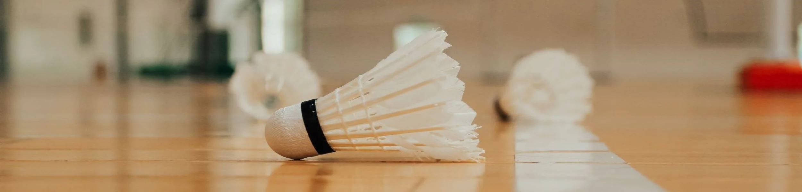
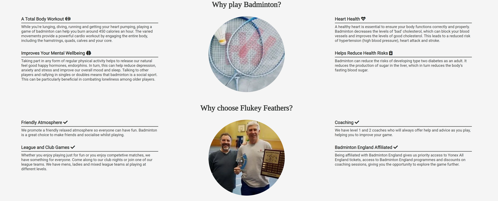
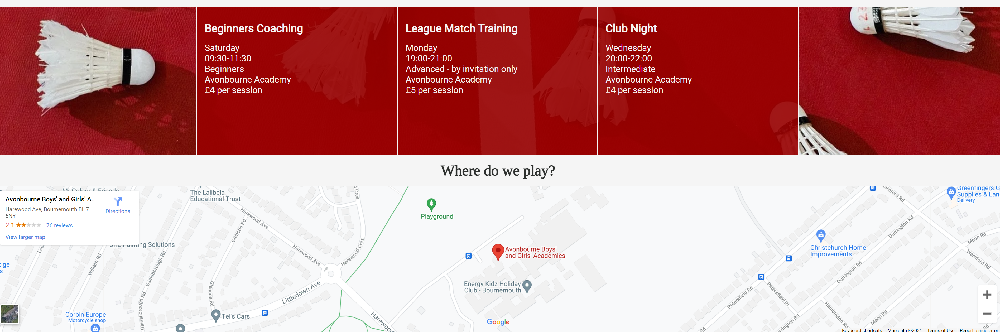
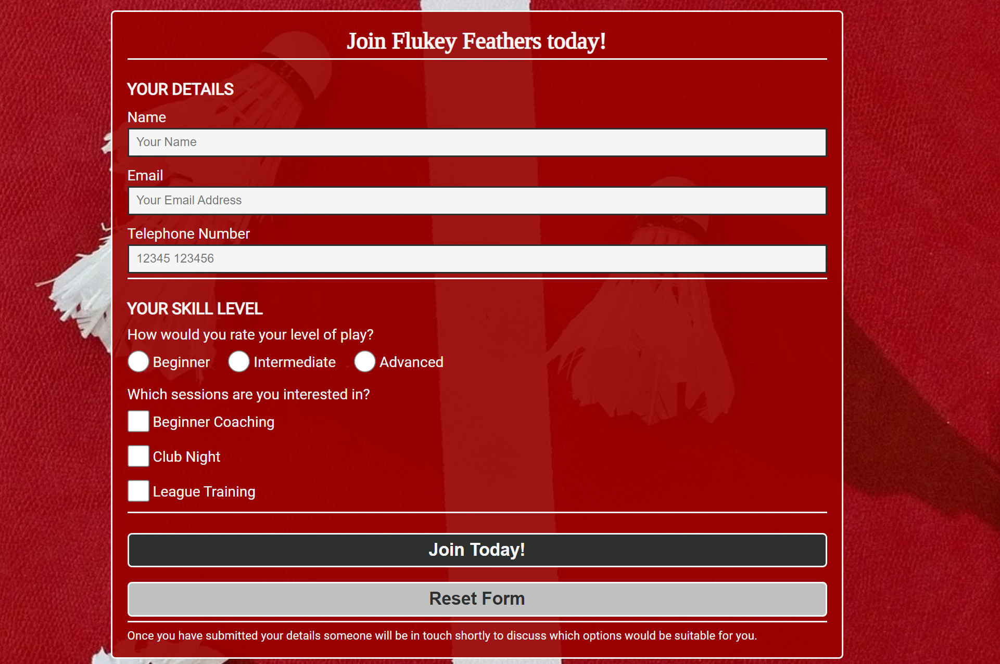

# **Flukey Feathers Badminton Club**

Flukey Feathers is a site that is designed to help people choose Badminton as a sport to play and Flukey Feathers as the club to join no matter what their skill set is.
The site is targeted towards potential or current badminton players based in or around the Bournemouth area who are looking for somewhere to play that is both friendly and social. 

## Table of contents
1. [**Planning Stage**](#planning-stage)
1. [**Features Common to all Pages**](#features-common-to-all-pages)
1. [**Features on Individual Pages**](#features-on-individual-pages)

## **Planning Stage**

### **Target Audience**
* Users who are looking to take up badminton as a sport to play
* Users who are looking to join a badminton club
* Users who are looking to switch badminton clubs

### **Site Aims**
* Educate the user on the health benefits of playing badminton
* Show the user the benefits of playing badminton with Flukey Feathers
* Provide the user with information that tells them when and where Flukey Feathers plays
* Give the user an opportunity to contact the club to join them

### **Wireframes**
To help organise how I was going to approach building the site I first got my initial ideas down onto some wireframe to help guide me through the basic layout of the site as I implemented various features. 
Links to the different pages:
* [Homepage (About)](docs/wireframes/home-about.png)
* [Club Sessions page](docs/wireframes/club-sessions.png)
* [Join Us page](docs/wireframes/join-us.png)

There was some deviation from the initial design as I implemented each page to improve the user experience but in general I stayed true to the initial design.

### **Color Scheme**
I chose a color scheme that was in keeping with the Flukey Feathers color scheme (red) whilst also being  easy to read for the user, through the use of back ground images and the navigation / footer color schemes, opting for a smokey white background and dark grey text in areas where these weren't used. 

## **Features Common to all Pages**
### **Hero Image**

* Designed to catch the eye when loading the page
* In theme with the FLukey Feathers club it features a shuttle cock on a badminton court
* A smaller version of the hero image is used for mobile layouts so it take up less screen real estate and doesn't dominate the page

### **Club Logo**

* Located within the hero image the logo so the user knows the site is about Flukey Feathers
* It also serves as a link back to the home page
* The logo scales on mobile screens as the screen size gets smaller so it doesn't dominate the hero image

### **Navigation Bar**

 * Located directly below the hero image
 * Its red background is designed to be eye catching and in line with Flukey Feathers' club color scheme
 * For ease of navigation as the mouse is hovered over a link, the background turns black so the user can see what they are selecting
 * The current page a user is on as a link that is underlined
 * As the page size decreases the nav bar is fully responsive and at the mobile level displays as a block vertically rather than horizontally
 * The navigation bar is designed as a journey for the user going from left to right as they explore the reasons why they should join Flukey Feathers before finally deciding to join the club

 ### **Footer**

 * Located at the bottom of the page
 * Its red background is designed to be eye catching and in line with Flukey Feathers' club color scheme
 * The footer has links to FLukey Feathers facebook page
 * There are also links to the Badminton England site and game rules site for users to explore their interest further
 * As the page size decreases the Badminton England and game rules links center on the page so they fit better in a tall narrow layout
 * Links to Badminton England and game rules are underlined to show they are 2 seperate links as they looked like 4 links (1 per word) before this was applied
 * The facebook link had its underlining removed as it was obvious this was a link

 ## **Features on Individual Pages**
 ### **About Us (Home) Page**
 
 * The About Us section will allow the user to see the benefits of playing badminton, encouraging the user to consider badminton as a form of exercise
 * It also shows the user the benefits of joining Flukey Feathers as their choice of club to play badminton and continue to explore the site
 * As the page size decreases the text area takes up more of the page with the images being pushed below. Finally as the page size reaches mobiles the benefits become block and display as a list, making usability on smaller screens easier

 ### **Club Sessions Page**

 * The club sessions page shows the user when Flukey Feathers plays, where they play, how much it costs and what skill level it caters for
 * This allows users to choose which session may be best for them with their interests and skill levels
 * A background image is used for the club sessions to draw the user in. It is in line of the Flukey Feathers scheme, with a red court surface covered with losts of Shuttlecocks
 * As the page resizes, the club sessions area is fully responsive, eventually displaying in a block list rather than horizontally to aide mobile navigation
 * Beneath the club sessions is an interactive map of the venue Flukey Feathers play at, allowing users to input this into their navigation systems to get directions

### **Gallery Page**

* The gallery will provide supporting images to the user so they can see what various sessions look like
* The gallery is valuable as the user can easily identify whether the club is something they are looking for or not

### **Join Us Page**

* This page will allow the user to join Flukey Feathers
* The user will be asked to submit their personal details as well as their skill level and what sessions they would be interested in joining
* This will allow Flukey Feathers to then discuss with the user which sessions would be appropriate to them
* A background image is used behind the form. This is the same as on the club sessions page for consistency and is inline with the Flukey Feathers club ethos
* The page is fully responsive with the form scaling to fit mobile screens

